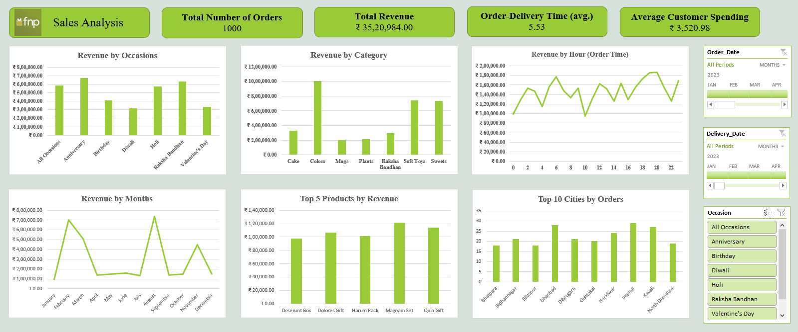

# Ferns N Petals (FNP): Sales Analysis Summary

## Overview

The analysis was based on a set of 10 business questions covering revenue, delivery efficiency, customer behavior, product performance, and geographic demand. An interactive Excel dashboard backed by pivot tables was built as the final deliverable, with slicers that allow anyone to filter the entire view by Date or Occasion.

**Dataset Scope**
1,**000** orders | Products, Customers, Order Dates, Delivery Dates, Occasions, Cities | Period: **2023**

## Headline Metrics

| Metric | Value |
|---|---|
| Total Revenue | ₹35,20,984 |
| Total Orders | 1,000 |
| Average Customer Spending | ₹3,520.98 |
| Average Order-to-Delivery Time | 5.53 days |

## Key Findings by Business Question

### Revenue & Spending

- The total revenue for **2023** was **₹35,20,**984**** across all occasions, products, and cities.
- Customers spent an average amount of **₹3,**520**.98 per order** which is a mid-to-high range that suggests deliberate and occasion-driven purchases rather than impulse buys.
- There is a clear opportunity to push this average higher through occasion-specific premium bundles and curated gift sets.

### Monthly Sales Performance

Revenue across **2023** was far from even. The business runs in sharp seasonal bursts tied almost entirely to the gifting calendar.

- **February (₹7,04,**509**)** — strongest month; Valentine's Day drives this spike almost single-handedly.
- **August (₹7,37,**389**)** — close second; Raksha Bandhan is the primary driver.
- **January (₹95,**468**), June, and July** — the weakest stretch of the year with no major occasion anchor.

The takeaway is straightforward: **FNP**'s revenue lives and dies by a handful of dates on the calendar. Inventory, staffing, and marketing plans need to be built backward from these peaks.

### Delivery Performance

- Average time between order and delivery date was **5.53 days** which is acceptable under normal conditions.
- A near-zero correlation (~0.**003478**) between order quantity & delivery time confirms that **bulk orders do not slow down fulfilment** implying a healthy operational sign.
- The risk window is during peak occasions when volume surges; delivery times should be tracked monthly and benchmarked against the 5.53-day baseline to catch any slippage early.

### Top Products by Revenue

| Rank | Product | Revenue |
|---|---|---|
| 1 | Magnam Set | ₹1,21,905 |
| 2 | Quia Gift | ₹1,14,476 |
| 3 | Dolores Gift | ₹1,06,624 |
| 4 | Harum Pack | ₹1,01,556 |
| 5 | Deserunt Box | ₹97,665 |

The above five products collectively contributed **₹5,42,**226** which is roughly 15.4% of total annual revenue**.  

What stands out is how tightly clustered their numbers are. There is no clear runaway bestseller, which means **FNP** does not yet have a flagship product that defines the brand. These five should be prioritized for stock availability, especially ahead of February and August.

### Revenue by Category

- **Colors (₹10,05,**645**)**: top revenue category overall, because of Holi.
- **Soft Toys (₹7,40,**831**)** & **Sweets (₹7,33,**842**)**: strong across multiple occasions.
- **Cake (₹3,29,**862**)**: consistent performer across birthdays & anniversaries.
- **Plants (₹2,12,**281**)** & **Mugs (₹2,01,**151**)**: clear underperformers with limited occasion-specific pull.

### Revenue by Occasion

| Occasion | Revenue |
|---|---|
| Anniversary | ₹6,74,634 |
| Raksha Bandhan | ₹6,31,585 |
| Holi | ₹5,74,682 |
| Birthday | ₹4,08,194 |
| Valentine's Day | ₹3,31,930 |
| Diwali | ₹3,13,783 |

**Anniversary & Raksha Bandhan** are **FNP**'s two most commercially valuable occasions. **Diwali and Valentine's Day**, despite being two of the largest gifting moments in India, are at the bottom, it is a gap that deserves direct attention.

### Top 10 Cities by Orders

| City | Orders |
|---|---|
| Imphal | 29 |
| Dhanbad | 28 |
| Kavali | 27 |
| Haridwar | 24 |
| Guntakal | 20 |
| Dibrugarh | 21 |
| Bidhannagar | 21 |
| North Dumdum | 19 |
| Bilaspur | 18 |
| Bhatpara | 18 |

Every single city in the top 10 is a **Tier 2 or Tier 3 location**. Metro cities do not feature at all. This is one of the most striking findings in the entire analysis and that the demand is already coming from smaller cities organically, without targeted marketing or optimized logistics. The question for **FNP** is whether its delivery infrastructure and local presence in these cities are keeping pace with that demand.

### Order Timing: When Customers Buy

Looking at order time by hour, activity builds through the day and clusters noticeably between **6 PM & 10 PM**. This is the most commercially active window and the most logical slot for push notifications, email campaigns, and time-limited offers.

## Dashboard Features

The Excel dashboard has three interactive slicers that filter every chart simultaneously:

| Slicer | What It Controls |
|---|---|
| Order Date | Filters by when the order was placed |
| Delivery Date | Filters by when the order was delivered |
| Occasion | Narrows all visuals to a specific event |

Six pivot-backed charts cover Revenue by Month, Hour, Occasion, Category, Top 5 Products, and Top 10 Cities.

## Recommendations

1. **Protect the February & August peaks**: These two months generate a disproportionate share of annual revenue. Dedicated stock planning, early logistics arrangements, and targeted campaigns should be locked in at least 6–8 weeks in advance.

2. **Audit Diwali & Valentine's Day**: Both occasions underperform relative to their true potential. A product-price-promotion review specific to these two events is the most actionable next step.

3. **Invest in Tier 2/3 city operations**: Imphal, Kavali, Haridwar, and others are already ordering without being directly targeted. Faster delivery and localized promotions in these markets could possibly grow revenue.

4. **Build a flagship product**: the top 5 products are too evenly matched. **FNP** would benefit from identifying or creating one hero product that becomes the go-to gift for its top occasions.

5. **Activate the 6–10 PM window**: customer order activity peaks here every day. This slot should be the primary window for any customer-facing communication or time-sensitive promotions.

6. **Revisit Plants and Mugs**: either reposition them around occasions where they fit better, or reduce catalogue space in favour of higher-performing categories like Soft Toys and Sweets.
